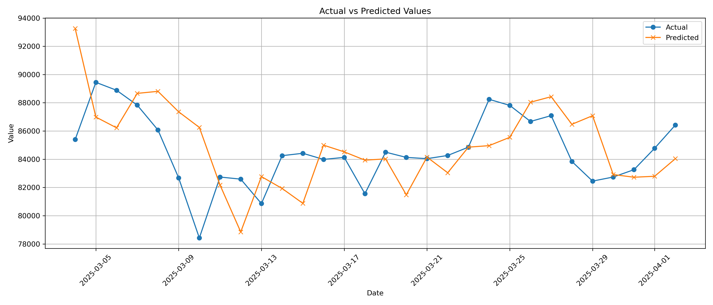

<h1 align="center"> Bitcoin Price Prediction using LSTM </h1>

---

##  Problem Statement

We aim to build a deep learning-based solution that can  forecast the **next-day Bitcoin closing price** using historical price data. Our focus was to use **real-time data**, preprocess it, and **retrain the model regularly** for better performance.

---

## 🚀 Tech Stack

| Layer        | Technology         | Description |
|--------------|--------------------|-------------|
| **Backend**  | CryptoCompare API  | Supplies historical and real-time cryptocurrency price data |
| **Modeling** | Python, LSTM (Keras) | Time-series forecasting using deep learning |
| **Database** | MySQL              | Stores historical price data used for training and inference |

---

## 🧪 Training Workflow (Historical Model Training)

<ol>
  <li>Collected daily historical data of Bitcoin from <strong>2011 to 2024</strong> using CryptoCompare API</li>
  <li>Performed EDA and Feature Engineering</li>
  <li>Built and trained an <strong>LSTM model</strong> for predicting next-day prices</li>
  <li>Evaluated and fine-tuned model performance using RMSE</li>
  <li>Saved the trained model and scalers using <code>pickle</code> for reuse</li>
</ol>

---

## 🔁 Real-Time Prediction Approach

<ol>
  <li>Fetched real-time data from the <strong>MySQL database</strong></li>
  <li>Applied same <strong>feature engineering</strong> steps as training</li>
  <li>Loaded previously trained scalers and LSTM model</li>
  <li>Evaluated model performance by comparing pre and post retraining RMSE</li>
  <li>If performance improved (RMSE ↓ 20%), the updated model was saved</li>
  <li>Made prediction for the next day and optionally averaged with original model’s prediction for final output</li>
</ol>

---

- CryptoCompare API → MySQL → Feature Engineering → LSTM Model → Prediction

### 2. Model Performance Graph  
## 📊 Actual vs Predicted Bitcoin Price

---

##  Built by:
**astha** and **krupanshi**   
A collaborative deep learning project

---

``
